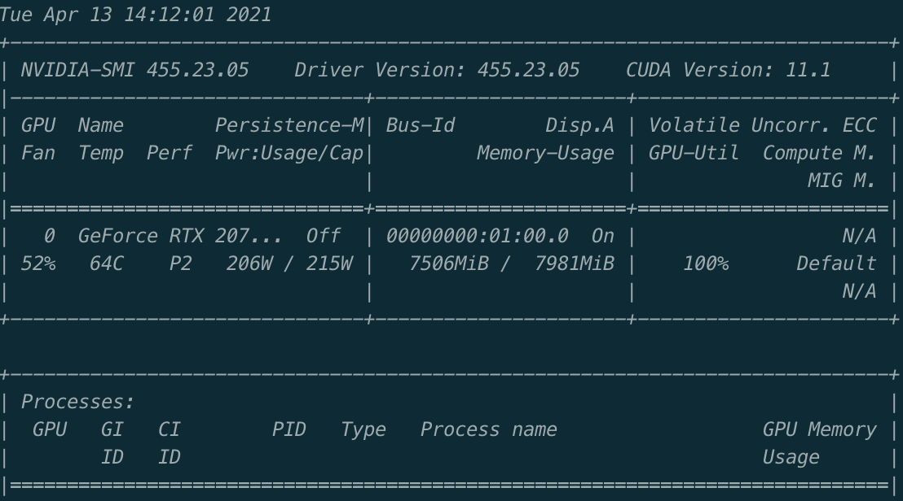
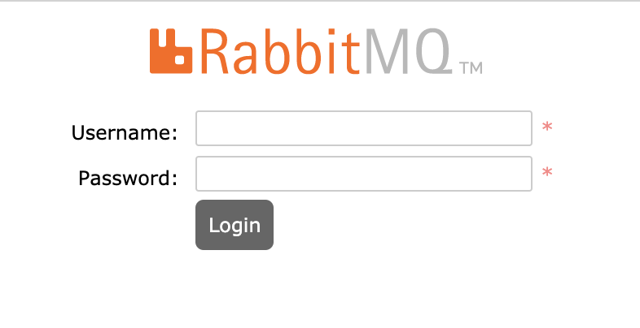
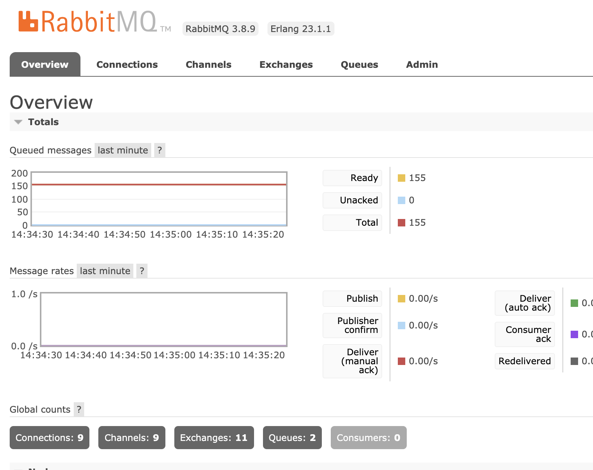
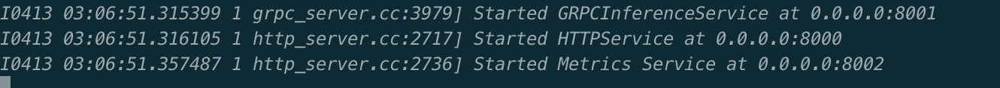
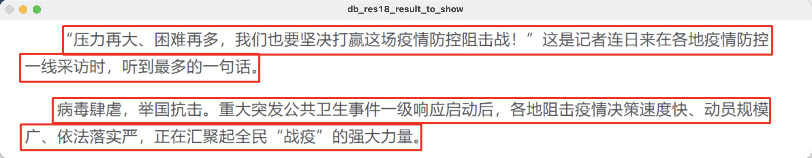
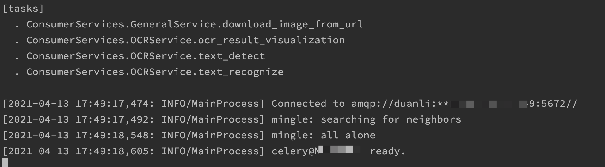
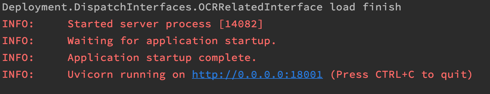
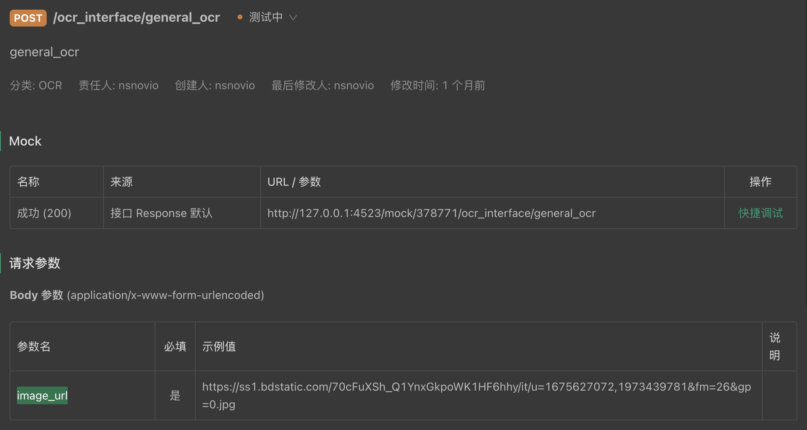
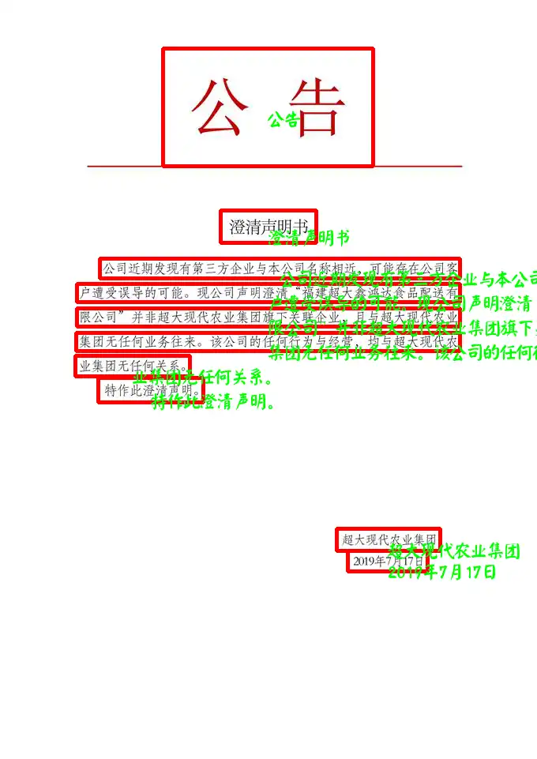

# 快速上手文档

本文档旨在帮助读者快速了解Savior，并且跑通demo。

## 环境安装

### 系统环境

- 操作系统：Ubuntu 16、18、20 均可（不支持Windows，WSL）

  > 其他Debian系的操作系统也可以，但是操作会跟ubuntu有所差异，请自行调整。
  >
  > CentOS也是一样的道理，需要根据系统实际情况进行配置。

- Nvidia驱动：455及以上

- Docker：19.03及以上

### Nvidia Docker安装

> 为了保证拉取一些镜像的时候的速度，可以使用阿里云的docker加速：[阿里云docker镜像加速器配置](https://cr.console.aliyun.com/cn-hangzhou/instances/mirrors)

安装Nvidia Docker之前事先需要确认当前主机的驱动是否正常。打开控制台输入`nvidia-smi`。如果能看到

证明当前设备的的显卡驱动已经正确。

根据[nvidia-docker toolkit](https://docs.nvidia.com/datacenter/cloud-native/container-toolkit/install-guide.html#docker)安装nvidia-docker并根据教程调出容器内的`nvidia-smi`的界面。

### 服务组件运行

#### [RabbitMQ](https://www.rabbitmq.com/)

如果有可用rabbitmq，获得用户名和密码。

> 如果本地环境没有rabbitmq，可以使用docker快速搭建一个自有的rabbitmq服务：
>
> `docker run --restart=always -d --hostname celery-broker --name celery-broker -p5672:5672 -p15672:15672 -e RABBITMQ_DEFAULT_USER=guest -e RABBITMQ_DEFAULT_PASS=guest rabbitmq:3-management`
>
> 这里启动的简易的rabbitmq的实例，其中用户名为guest，密码为guest。
>
> 如果启动成功可以通过访问页面：http://localhost:15672看到如下界面：
>
> 

进入rabbitmq的登录页面输入用户名和密码，点击登录，看到如下类似界面：



说明rabbitmq已经成功启动并且账号密码无误。

#### [Triton](https://github.com/triton-inference-server/server)

1. 创建文件夹**TritonModelRepo**

2. 前往[百度云](https://pan.baidu.com/s/1DvSQMM76gGAltPLma6w1wQ)(密码：sg11)，进入`部署框架/triton`目录下，下载DB_res18，CRNN_res34，TextOrientationClassification三个文件夹到**TritonModelRepo**中。

3. 通过Docker启动Triton：`docker run --gpus=all --rm -p8000:8000 -p8001:8001 -v/TritonModelRepo的全路径:/models --shm-size=1g --ulimit memlock=-1 --ulimit stack=67108864 nvcr.io/nvidia/tritonserver:21.03-py3 tritonserver --model-repository=/models`

   > 可以前往[Triton Relase](https://github.com/triton-inference-server/server/releases)下载最新的source包，然后通过`build.py`构建自己的Triton Server，并配置对应的模型的文件夹地址。

4. 如果出现说明启动成功。如果未出现，需要查看Triton输出的日志信息。

## 代码测试

为了验证Triton已经部署成功，可以直接通过运行算子检验目前配置好的Triton是否正确加载模型。

1. git clone https://github.com/novioleo/Savior.git

2. 进入到Savior文件夹中，使用conda创建环境`conda create -n SaviorEnv python=3.8`（不推荐使用virtualenv），激活环境`source activate SaviorEnv`

3. 安装tritonclient依赖`python -m pip install tritonclient==2.8.0 -i https://pypi.ngc.nvidia.com --trusted-host pypi.ngc.nvidia.com`，安装剩余依赖`python -m pip install --progress-bar on -r requirements.txt -i  https://mirrors.aliyun.com/pypi/simple --trusted-host mirrors.aliyun.com`。

4. 测试文本检测模型`python  ./Operators/ExampleTextDetectOperator/TextDetectOperator.py -i ./TestImages/TextDetectImage.png -u triton的地址 -p triton的端口`

   > 
   >
   > 如果一切正常则会得到文本的检测结果。

5. 测试文本识别模型`python  ./Operators/ExampleTextRecognizeOperator/TextRecognizeOperator.py -i ./TestImages/ExtractedTextImage.png -u triton的地址 -p triton的端口`

   > 如果一切正常则会得到文本识别的结果
   >
   > ```json
   > {"probability": [0.9982603,
   >                  0.9938134,
   >                  0.99923086,
   >                  0.999629,
   >                  0.9930923,
   >                  0.99371284,
   >                  0.95337,
   >                  0.9981487,
   >                  0.9937138],
   >  "text": "口田日MWOIUn"}
   > 
   > ```

6. 测试文本方向识别模型`python  ./Operators/ExampleTextOrientationClassificationOperator/TextOrientationClassificationOperator.py -i ./TestImages/ExtractedFlippedTextImage.png -u triton的地址 -p triton的端口`

   > 如果一切正常则会得到文本方向识别结果
   >
   > ```json
   > {"orientation": <TextImageOrientation.ORIENTATION_180: 2>}
   > ```

## 代码配置

为了运行一个满足本地各种组件的一个服务，需要进行相关配置。

1. 进入Savior的development文件夹

2. 复制文件server_config.py.template到server_config.py

3. 进入server_config.py中，找到`AVAILABLE_INTERFACES`变量和`AVAILABLE_SERVICES`，改为：

   ```python
   AVAILABLE_INTERFACES = [
       #('Deployment.DispatchInterfaces.DummyInterface', '/dummy_interface'),
       ('Deployment.DispatchInterfaces.OCRRelatedInterface', '/ocr_interface'),
   ]
   AVAILABLE_SERVICES = [
       'Deployment.ConsumerServices.GeneralService',
       'Deployment.ConsumerServices.OCRService',
       # 'Deployment.ConsumerServices.DummyService',
   ]
   ```

   找到rabbitmq配置相关，根据上面配置的rabbitmq进行对应的配置：

   ```python
   if IS_TEST:
       WORKER_RABBITMQ_USERNAME = 'guest'
       WORKER_RABBITMQ_PASSWORD = 'guest'
       WORKER_RABBITMQ_HOST = 'localhost'
       WORKER_RABBITMQ_PORT = '5672'
       WORKER_RABBITMQ_VHOST = '/'
   else:
       WORKER_RABBITMQ_USERNAME = 'guest'
       WORKER_RABBITMQ_PASSWORD = 'guest'
       WORKER_RABBITMQ_HOST = 'localhost'
       WORKER_RABBITMQ_PORT = '5672'
       WORKER_RABBITMQ_VHOST = '/'
   ```

   找到triton配置相关，根据上面配置的triton进行对应的配置：

   ```python
   OCR_TRITON_URL = 'localhost'
   OCR_TRITON_PORT = 8001
   ```

## 测试服务启动

1. 启动Celery worker，启动控制台并进入Savior文件夹，执行`celery -A Deployment.ConsumerWorker worker --loglevel=INFO`

   > 启动成功会得到以下页面：
   >
   > 

2. 启动web服务器，启动控制台并进行Savior文件夹，执行`python Deployment/DispatchServer.py`

   > 启动成功会得到以下页面：
   >
   > 

## 服务测试

为了更加方便进行后续测试，推荐使用[apifox](https://www.apifox.cn/)进行api测试。

创建一个接口地址为`/ocr_interface/general_ocr`，请求类型为`POST`，请求Body类型为`application/x-www-form-urlencoded`，Body中含有一个必填字段的`image_url`。

> 创建成功后如下图所示：
>
> 

点击运行进行接口测试（需要自行配置环境），并将`image_url`填为：http://www.chaoda.com/upload/201907/1563411797188792.jpg ,运行接口（如果前几次需要多等待下，triton需要预热，后面就正常速度），得到如下json：

```json
{
    "bucket_name": "result",
    "path": "20210413/355bf5c6265a495aa441e17da22869c5.webp",
    "url": "/tmp/DummyOSS-temp-directory/result/20210413/355bf5c6265a495aa441e17da22869c5.webp",
    "dag": {
      ... 暂时不用管的一堆东西...
    }
}
```

其中url为生成图像的路径。如下：



至此，恭喜将demo顺利打通。可以自行测试当前接口，也可以参考其他文档，进行更丰富的测试。
