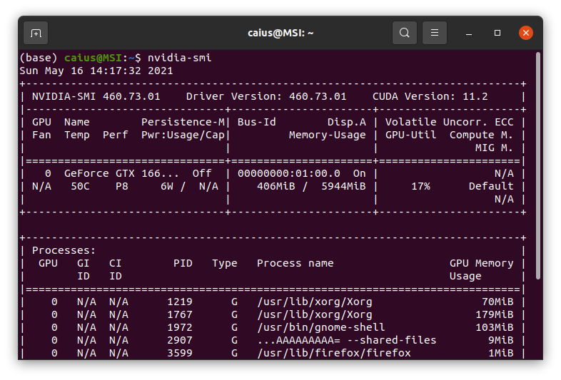
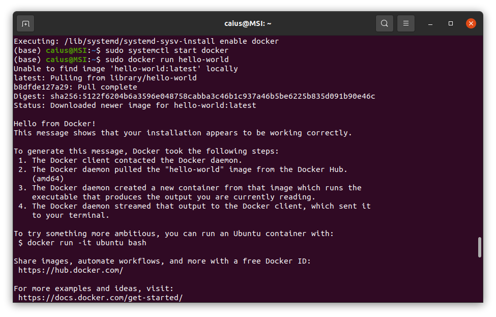
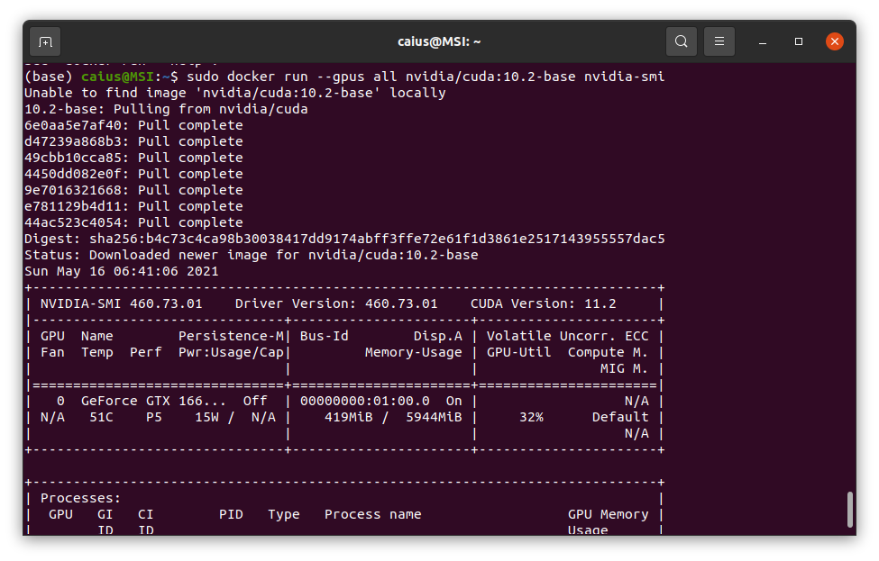
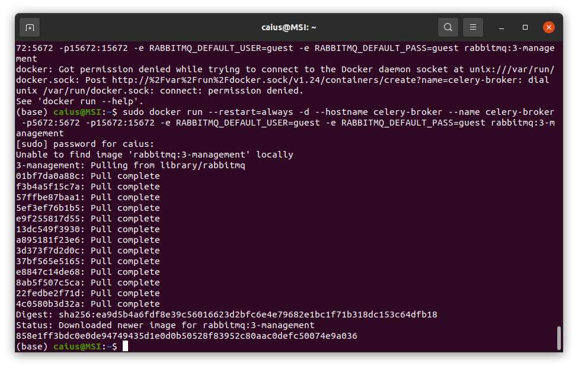
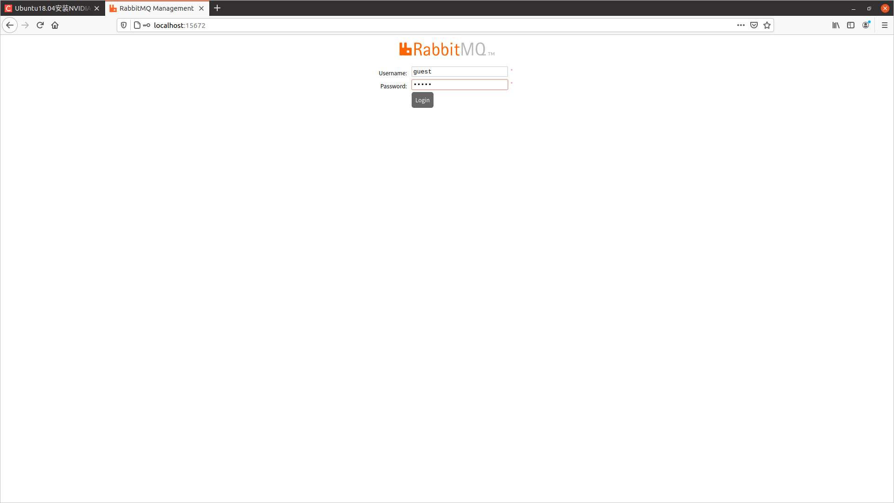
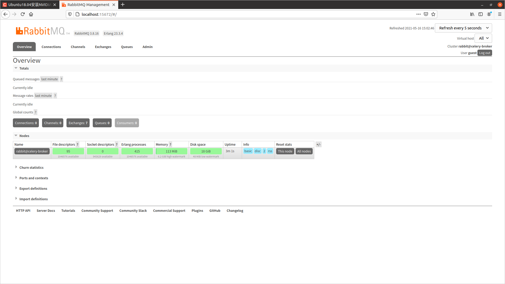
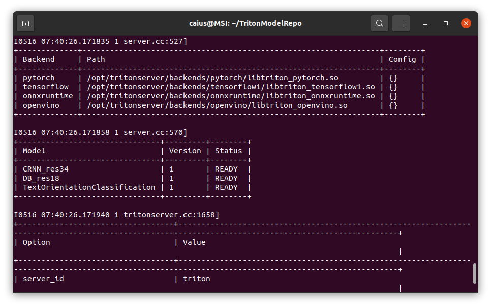
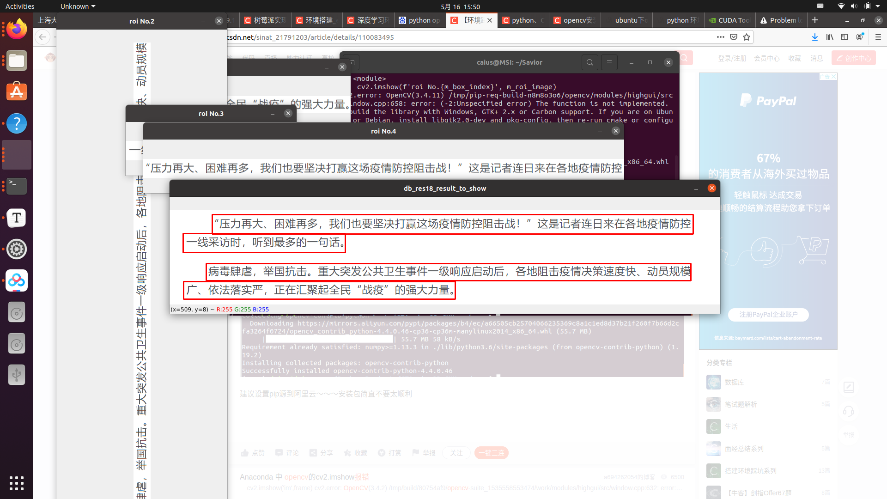

### Ubuntu20.04 

### Typora安装

~~~~sh
sudo apt-key adv --keyserver keyserver.ubuntu.com --recv-keys BA300B7755AFCFAE
sudo add-apt-repository 'deb http://typora.io linux/'
sudo apt-get update
sudo apt-get install typora
~~~
### Nvidia Docker安装
* Nvidia驱动：455及以上
* Docker：19.03及以上
安装之前先确认nvidia驱动是否安装正常
若出现上面这样则安装完成
#### 安装docker
1.更新包，安装相应的依赖项
~~~sh
(base) caius@MSI:~$ sudo apt-get install \
>     apt-transport-https \
>     ca-certificates \
>     curl \
>     gnupg-agent \
>     software-properties-common
~~~
2.添加官方秘钥
~~~sh
(base) caius@MSI:~$ curl -fsSL https://download.docker.com/linux/ubuntu/gpg | sudo apt-key add -
OK
~~~
3.验证秘钥
~~~sh
(base) caius@MSI:~$ sudo apt-key fingerprint 0EBFCD88
pub   rsa4096 2017-02-22 [SCEA]
      9DC8 5822 9FC7 DD38 854A  E2D8 8D81 803C 0EBF CD88
uid           [ unknown] Docker Release (CE deb) <docker@docker.com>
sub   rsa4096 2017-02-22 [S]

~~~
4.使用稳定版本库
~~~sh
(base) caius@MSI:~$ sudo add-apt-repository \
>    "deb [arch=amd64] https://download.docker.com/linux/ubuntu \
>    $(lsb_release -cs) \
>    stable"
~~~
#### 安装Docker Engine
~~~sh
(base) caius@MSI:~$ sudo apt-get update

(base) caius@MSI:~$ sudo apt-get install docker-ce docker-ce-cli containerd.i
~~~

#### 测试
启动docker
~~~sh
(base) caius@MSI:~$ sudo systemctl enable docker
Synchronizing state of docker.service with SysV service script with /lib/systemd/systemd-sysv-install.
Executing: /lib/systemd/systemd-sysv-install enable docker
(base) caius@MSI:~$ sudo systemctl start docker
~~~
打印hello-word
~~~sh
(base) caius@MSI:~$ sudo docker run hello-world
~~~
显示如下

#### 配置nvidia-docker源
1. 添加源
~~~sh
distribution=$(. /etc/os-release;echo $ID$VERSION_ID)
(base) caius@MSI:~$ curl -s -L https://nvidia.github.io/nvidia-docker/gpgkey | sudo apt-key add -
OK
(base) caius@MSI:~$ curl -s -L https://nvidia.github.io/nvidia-docker/$distribution/nvidia-docker.list | sudo tee /etc/apt/sources.list.d/nvidia-docker.list
~~~
2. 安装nvidia-container-toolkit并重启docker
~~~sh
(base) caius@MSI:~$ sudo apt-get update && sudo apt-get install -y nvidia-container-toolkit
(base) caius@MSI:~$ sudo systemctl restart docker

~~~
3.测试
~~~ sh
(base) caius@MSI:~$ sudo docker run --gpus all nvidia/cuda:10.2-base nvidia-smi
~~~
出现下面这些则代表安装成功

### Anaconda
Anaconda3-2020.11[百度网盘][https://pan.baidu.com/s/1btKtvHBXrpbYAnBWI2EU_w] 密码: wvk8
~~~bash
caius@MSI:~$ cd  Downloads/
caius@MSI:~/Downloads$ ls
Anaconda3-2020.11-Linux-x86_64.sh  pycharm-professional-2021.1.1.tar.gz
baidunetdisk_3.5.0_amd64.deb       sogouimebs.deb
pycharm-professional-2021.1.1
caius@MSI:~/Downloads$ bash Anaconda3-2020.11-Linux-x86_64.sh 
~~~

### 安装Savior虚拟环境
~~~bash
(base) caius@MSI:~$ git clone https://github.com/novioleo/Savior.git
(SaviorEnv) caius@MSI:~$  cd Savior/
(SaviorEnv) caius@MSI:~/Savior$  conda create -n SaviorEnv python=3.8
(SaviorEnv) caius@MSI:~/Savior$  conda activate SaviorEnv

(SaviorEnv) caius@MSI:~/Savior$  python -m pip install tritonclient==2.8.0 -i https://pypi.ngc.nvidia.com --trusted-host pypi.ngc.nvidia.com
ERROR: Could not find a version that satisfies the requirement numpy>=1.19.1 (from tritonclient)
ERROR: No matching distribution found for numpy>=1.19.1
pip install numpy>=1.19.1

(SaviorEnv) caius@MSI:~/Savior$  python -m pip install tritonclient==2.8.0 -i https://pypi.ngc.nvidia.com --trusted-host pypi.ngc.nvidia.com

ERROR: Could not find a version that satisfies the requirement python-rapidjson>=0.9.1 (from tritonclient)
ERROR: No matching distribution found for python-rapidjson>=0.9.1

(SaviorEnv) caius@MSI:~/Savior$ pip install python-rapidjson>=0.9.1

(SaviorEnv) caius@MSI:~/Savior$ python -m pip install tritonclient==2.8.0 -i https://pypi.ngc.nvidia.com --trusted-host pypi.ngc.nvidia.com
Looking in indexes: https://pypi.ngc.nvidia.com
Collecting tritonclient==2.8.0
  Using cached https://developer.download.nvidia.cn/compute/redist/tritonclient/tritonclient-2.8.0-py3-none-manylinux1_x86_64.whl (8.4 MB)
Requirement already satisfied: python-rapidjson>=0.9.1 in /home/caius/anaconda3/envs/SaviorEnv/lib/python3.8/site-packages (from tritonclient==2.8.0) (1.0)
Requirement already satisfied: numpy>=1.19.1 in /home/caius/anaconda3/envs/SaviorEnv/lib/python3.8/site-packages (from tritonclient==2.8.0) (1.20.3)
Installing collected packages: tritonclient
Successfully installed tritonclient-2.8.0

(SaviorEnv) caius@MSI:~/Savior$ python -m pip install --progress-bar on -r requirements.txt -i https://mirrors.aliyun.com/pypi/simple --trusted-host mirrors.aliyun.com
~~~
到此安装完成

### 服务组件运行
#### docker快速搭建一个自有的rabbitmq服务
~~~sh
(base) caius@MSI:~$ sudo docker run --restart=always -d --hostname celery-broker --name celery-broker -p5672:5672 -p15672:15672 -e RABBITMQ_DEFAULT_USER=guest -e RABBITMQ_DEFAULT_PASS=guest rabbitmq:3-management
[sudo] password for caius: 
Unable to find image 'rabbitmq:3-management' locally
~~~
会出现下面的结果

如果启动成功可以通过访问页面: http://localhost:15672
用户名为guest，密码为guest

登录见到如下界面

#### Triton部署
1.创建文件夹TritonModelRepo
~~~sh
(base) caius@MSI:~$ mkdir TritonModelRepo
~~~
2.前往[百度云][https://pan.baidu.com/s/1DvSQMM76gGAltPLma6w1wQ](密码：sg11)，进入部署框架/triton目录下，下载DB_res18，CRNN_res34，TextOrientationClassification三个文件夹到TritonModelRepo中。

3. 通过Docker启动Triton
* 这里要把TritonModelRepo换成自己的路径,我这里是/home/caius/TritonModelRepo/
~~~sh
(base) caius@MSI:~/TritonModelRepo$ sudo docker run --gpus=all --rm -p8000:8000 -p8001:8001 -v/home/caius/TritonModelRepo:/models --shm-size=1g --ulimit memlock=-1 --ulimit stack=67108864 nvcr.io/nvidia/tritonserver:21.03-py3 tritonserver --model-repository=/models
~~~
出现下图表示安装成功

### 代码测试
1. 测试文本检测模型
这里的IP地址为本地127.0.0.1 端口默认为8001
~~~sh
(SaviorEnv) caius@MSI:~/Savior$ python ./Operators/ExampleTextDetectOperator/TextDetectOperator.py -i ./TestImages/TextDetectImage.png -u 127.0.0.1 -p 8001
Traceback (most recent call last):
  File "./Operators/ExampleTextDetectOperator/TextDetectOperator.py", line 5, in <module>
    from Operators.DummyAlgorithmWithModel import DummyAlgorithmWithModel
ModuleNotFoundError: No module named 'Operators'

需要加一下
(SaviorEnv) caius@MSI:~/Savior$ export PYTHONPATH=$PYTHONPATH:~/Savior

(SaviorEnv) caius@MSI:~/Savior$ python ./Operators/ExampleTextDetectOperator/TextDetectOperator.py -i ./TestImages/TextDetectImage.png -u 127.0.0.1 -p 8001

报错
(SaviorEnv) caius@MSI:~/Savior$ python ./Operators/ExampleTextDetectOperator/TextDetectOperator.py -i ./TestImages/TextDetectImage.png -u 127.0.0.1 -p 8001
Traceback (most recent call last):
  File "./Operators/ExampleTextDetectOperator/TextDetectOperator.py", line 129, in <module>
    cv2.imshow(f'roi No.{m_box_index}', m_roi_image)
cv2.error: OpenCV(3.4.11) /tmp/pip-req-build-n8m8o3o6/opencv/modules/highgui/src/window.cpp:658: error: (-2:Unspecified error) The function is not implemented. Rebuild the library with Windows, GTK+ 2.x or Carbon support. If you are on Ubuntu or Debian, install libgtk2.0-dev and pkg-config, then re-run cmake or configure script in function 'cvShowImage'
解决方法：
pip install opencv-contrib-python

~~~

成功如下

2. 测试文本识别模型
~~~sh
(SaviorEnv) caius@MSI:~/Savior$ python ./Operators/ExampleTextRecognizeOperator/TextRecognizeOperator.py -i ./TestImages/ExtractedTextImage.png -u 127.0.0.1 -p 8001
{'probability': [0.9982603,
                 0.9938134,
                 0.99923086,
                 0.999629,
                 0.9930923,
                 0.99371284,
                 0.95336974,
                 0.9981487,
                 0.9937138],
 'text': '口田日MWOIUn'}

~~~
3. 测试文本方向识别模型
~~~sh
(SaviorEnv) caius@MSI:~/Savior$ python ./Operators/ExampleTextOrientationClassificationOperator/TextOrientationClassificationOperator.py -i ./TestImages/ExtractedFlippedTextImage.png -u 127.0.0.1 -p 8001
{'orientation': <TextImageOrientation.ORIENTATION_180: 2>}

~~~

[docker安装参考][https://blog.csdn.net/weixin_38369492/article/details/105809571?utm_medium=distribute.pc_relevant.none-task-blog-baidujs_title-1&spm=1001.2101.3001.4242]