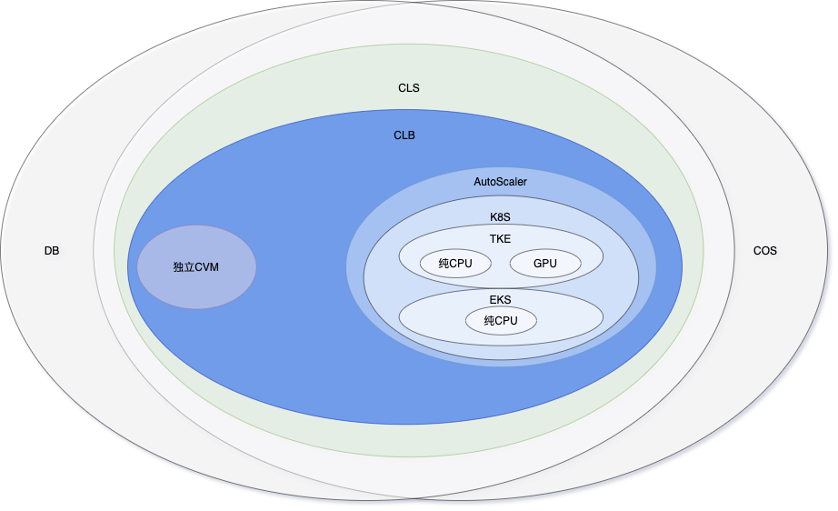

# 腾讯云实战

## 需要依赖的基础建设

### 基础设施组件解释

- COS：腾讯云的OSS，用于存储CLS的日志，存储用户上传的数据，存储结果，以及存储Triton的模型等。
- DB：腾讯云的数据库，包括但不限于MySQL、PostgreSQL等，用于存储业务数据以及框架历史调度信息等。
- CLS：腾讯云的中心化日志系统，用于收集所有服务器、所有服务产生的日志，为后面日志错误排查以及统计做基本支撑。
- CLB：腾讯云的负载均衡，用于将流量分流至不同服务器。
- 独立CVM：腾讯云的虚拟机，这里指代一些已有或者准备构建的服务器，用于部署其他依赖型服务（Kibana、apmserver等）。（尽量避免少出现）
- AutoScaler：腾讯云的自动伸缩，与CLB一起使用，通过监控K8S集群的运行情况，对特定的Pod进行横向扩展。
- K8S：泛指腾讯云的虚拟化集群。
- TKE：基于腾讯云的CVM或者实体机的自建集群，用于编排部署服务。
- EKS：基于腾讯云的公共CVM的公共集群，用于灵活的编排部署服务。
- 纯CPU：这里指代没有GPU的服务器，用于执行执行一些CPU计算密集型计算。
- GPU：这里指代含有GPU的服务器，用于部署Triton，并完成模型推理等相关工作。

### 服务组件解释

- RabbitMQ：可原生集群部署，用于Celery进行任务发布与结果获取。
- Triton：可集群部署，用于中心化部署深度学习模型，最高效率的利用完服务器性能。
- apm-server：不需要集群部署，可用于记录所有请求的状态以及效率的。（腾讯云的自己还在内测，可以用elastic官方的apm-server，后期可以切换）
- Savior-Dispatch：可集群部署，用于接收外部请求并将请求通过Celery分发到RabbitMQ中，供Celery Worker执行。
- Savior-Consumer：可集群部署，用于获取Celery分发的任务并执行，将结果利用RabbitMQ进行返回。

> **解释**
>
> 可原生集群部署：官方提供的集群部署方案，例如有Master-Slave的模式，P2P的模式等。
>
> 可集群部署：启动多个节点，使用CLB进行流量分发达到集群的效果。

## 如何部署

## 优化技巧

