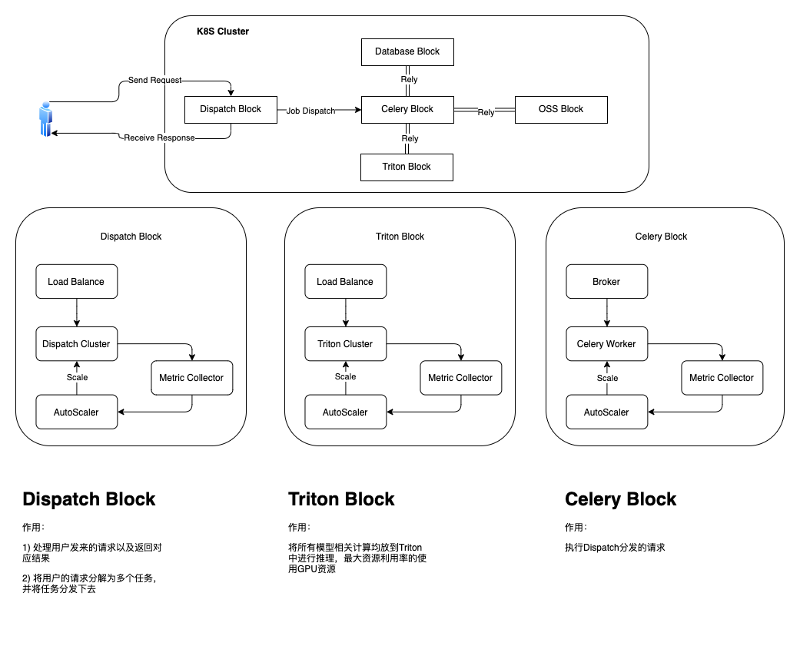

# Savior

**save your time.**

**只在Ubuntu18.04，Mac Big Sur下完成全部测试，其他平台暂时未测试。**

**目前项目还处于早期开发阶段，如有任何问题，欢迎添加微信nsnovio，备注部署，进群交流。**

## 背景

`savior`是一个能够进行快速集成算法模块并支持高性能部署的轻量开发框架。能够帮助将团队进行快速想法验证（PoC），避免重复的去github上找模型然后复现模型；能够帮助团队将功能进行流程拆解，很方便的提高分布式执行效率；能够有效减少代码冗余，减少不必要负担。

这个项目的核心目的就是能够减少大家的重复性开发，能够把绝大部分能够直接白嫖的东西放在框架里面，然后大家专注于自己的业务属性上，提升大家的工作效率。

## 架构图

## 特性

1. 弹性伸缩：用户可以根据目前的请求量，自定义配置机器数。方便项目上量，并且保证服务器资源吃满（支持K8S）。
2. 流程DAG：用户通过自定义自己的流程，框架支持DAG，保证流程的最高的并行度。
3. 容灾能力强：集群中所有节点都是相同作用，不会因为部分节点挂掉而服务崩溃。
4. 可扩展性强：框架主要是实现了一种设计模式，开发者只需要按照当前设计模式，扩展性无上限。
5. 部署便捷：部署到上线不会超过5分钟（不考虑网速）。

## 依赖的第三方组件

- rabbitmq：用于celery进行分布式的任务分发

- triton：用于gpu端的模型服务的集中部署

- milvus：用于特征向量搜索，存储【推荐有搜索需求的用户自行配置】

    > 如果觉得milvus太大，用户可以根据自己的自身情况直接使用faiss或者nmslib。并且自己实现对应helper。

## 框架中已集成的算法

> 🌈更多算子或服务欢迎在issue中补充，也十分欢迎您的PR。

| 名称（与模型文件夹同名）                                     | 类别             | 是否实现 | 备注                                                         |
| ------------------------------------------------------------ | ---------------- | -------- | ------------------------------------------------------------ |
| [UltraFaceDetect](https://github.com/Linzaer/Ultra-Light-Fast-Generic-Face-Detector-1MB) | 人脸检测         | ✅        | 模型小，速度快，精度满足绝大部分正常场景                     |
| [RetinaFaceDetect](https://github.com/deepinsight/insightface) | 人脸检测         | ✅        | 模型大，速度较快，对于小人脸和刁钻角度的人脸有更好的效果     |
| [FaceParsing](https://github.com/zllrunning/face-parsing.PyTorch) | 人脸语义分区     | ✅        | 基于CelebHQ训练的BiSeV1，对于大部分人脸的分区准确率高，准实时级别。 |
| [Landmark2D](https://github.com/deepinsight/insightface)     | 人脸对齐         | ✅        | 回归106个点坐标，对于倾斜角度超过正负60度，都无法准确识别    |
| [FaceEmbedding](https://github.com/ZhaoJ9014/face.evoLVe.PyTorch) | 人脸特征提取     | ✅        | 基于私有数据集训练的亚洲人脸特征向量提取，1：1000的准确率在99%+ |
| [SilentFaceAntiSpoofing](https://github.com/minivision-ai/Silent-Face-Anti-Spoofing) | 静默人脸活体检测 | ✅        | V1的效果差强人意，V2的效果还行。                             |
| [Fair](https://github.com/dchen236/FairFace)                 | 人脸属性         | ✅        | 年龄范围、性别、种族                                         |
| [HumanMattingWithU^2Net](https://github.com/xuebinqin/U-2-Net) | 人体抠图         | ✅        | 基于U^2Net的SOD（主体目标）人体抠图，对于新闻场景效果好。但是残差层很多，占用显存很大 |
| HumanMattingWithBiSe                                         | 人体抠图         | ✅        | 基于BiSeV1的segment的结果，增加小号的encoder+decoder进行边缘refine的人体抠图。占用显存小，且细节保留更多。 |
| [DB](https://github.com/WenmuZhou/PytorchOCR)                | 文本检测         | ✅        | 有两个backbone的版本，分别是res18和mbv3。其中res18的模型准确率相较mbv3高差不多10个点。如果不是速度和容量有需求，推荐res18的模型 |
| [CRNN](https://github.com/WenmuZhou/PytorchOCR)              | 文本识别         | ✅        | 有两个backbone的版本，分别是res34和mbv3。其中res34的模型准确率相较mbv3高差不多5个点。如果不是速度和容量有需求，推荐res34的模型。 |
| 文档图像方向矫正                                             | 图像预处理       | ✅        | 提取线条，找到所有线条的方向，找到其中的众数，作为文本方向   |
| [TextOrientationClassification](https://github.com/frotms/PaddleOCR2Pytorch) | 文本行方向回归   | ✅        | 对于横向的文本进行方向分类，分类出正向和180°                 |
| NRIQA                                                        | IQA              | ✅        | 一些基本的无参考的IQA算法                                    |
| [QRCodeDetect](https://github.com/WeChatCV/opencv_contrib/tree/master/modules/wechat_qrcode/src/detector) | 二维码           | ✅        | 微信的基于mbv2的二维码的ssd                                  |
| [网页、杂志等数据版式分析](https://github.com/Layout-Parser/layout-parser) | 版式分析         | ❌        |                                                              |
| [文章数据版式分析](https://github.com/Layout-Parser/layout-parser) | 版式分析         | ❌        |                                                              |
| [PICK](https://github.com/wenwenyu/PICK-pytorch)             | 关键信息提取     | ❌        |                                                              |

> 目前已经组装集成了一些常用的Service，可以直接在interface层调用。

已适配模型下载地址（不定时更新）：

- [百度网盘](https://pan.baidu.com/s/1DvSQMM76gGAltPLma6w1wQ)  密码: sg11

> 根据自己的需要下载模型，不用全部下载。
>
> 所有模型都是基于gpu进行转换的。其中部分模型（例如CRNN）带有RNN模块，triton在cpu的状态下没法在gpu转换的模型中正常推理，会报错。配合上专用的cpu版本即可。
> 但是考虑到绝大部分使用此框架的人，不会使用cpu的推理版本，所以这里就不放出来了。如果有需要，可以提issue。

## 文档

[快速上手](./Docs/QuickStart.md)

[编写自己的项目](./Docs/HowToDevelop.md)

[单机部署](./Scripts/Standalone/Readme.md)

[腾讯云实战(WIP)](./Docs/腾讯云部署实战.md)
## 感谢

感谢各位开源项目大佬的无私奉献。

