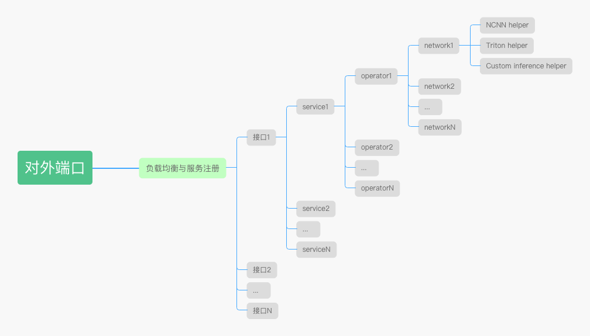
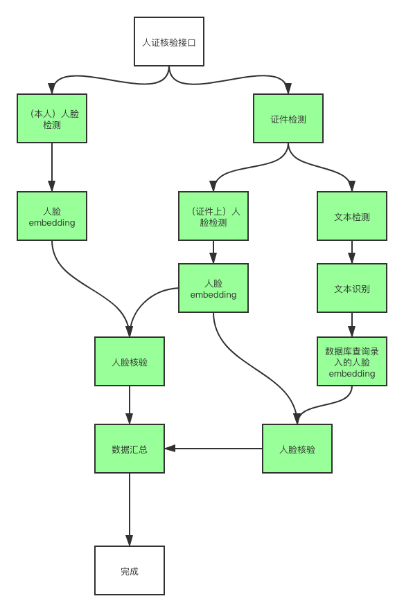

# 图像算法服务部署框架

**欢迎白嫖。**

## 0x01 背景

为了简化小团队的在开发出算法后需要进行的复杂的服务部署，并且帮助小团队进行模块化流程化开发。
理论上能够方便小团队快速进行想法验证。

**并且避免重复造简单的轮子。**

**顺便内卷（手动狗头**

## 0x02 特性

1. 可伸缩
2. 快速集成
3. 服务解耦
4. 支持传统服务和深度学习的模型的配合
5. 支持复杂multi stage的服务

## 0x03 使用的第三方库

1. celery
2. redis
3. fastapi
4. ncnn
5. triton
6. rabbitmq

## 0x04 Model Repo

官方已适配模型下载地址（不定时更新）：

- [百度网盘](https://pan.baidu.com/s/1DvSQMM76gGAltPLma6w1wQ)  密码: sg11

## 0x05 Contributors

## 0x06 快速部署模型的支持列表

> 更多开源模型欢迎在issue中补充，也十分欢迎您的PR。

### 人脸相关

- [ ] [UltraFaceDetect](https://github.com/Linzaer/Ultra-Light-Fast-Generic-Face-Detector-1MB)
- [ ] [FaceParsing](https://github.com/zllrunning/face-parsing.PyTorch)
- [ ] [Landmark2D](https://github.com/deepinsight/insightface)
- [ ] [FaceEmbedding](https://github.com/ZhaoJ9014/face.evoLVe.PyTorch)

### OCR相关
- [ ] [DB](https://github.com/WenmuZhou/PytorchOCR)
- [x] [CRNN](https://github.com/WenmuZhou/PytorchOCR)

## 0x07 框架思路

### 逻辑框架

#### 应用层

所有HTTP接口将会注册到负载均衡与服务注册上去，可以通过负载均衡的相应接口直接调用后侧服务。

#### 接口层

每个接口可能有多个stage的service完成，不同service之间可能存在并行串行的关系。例如一个人证核验的接口，如下图所示：

>  上图中中所有绿色的block均为service。

service能够根据实际业务的情况进行复用。

#### 操作原子层

每个service可以由多个operator组成，例如人脸的皱纹检测，包括法令纹检测的operator，鱼尾纹检测的operator，抬头纹的operator等。当然也可以将每个operator放到多个单独的service，然后组成多stage的接口。下面是基于不同侧重点的比较：

> :star: 越多说明优势约明显

| 不同模式比较 | 多service多operator            | 单service多operator            |
| ------------ | ------------------------------ | ------------------------------ |
| 开发便捷性   | :star: :star::star:            | :star::star::star::star::star: |
| 可扩展性     | :star::star::star::star::star: | :star::star:                   |
| 运行效率     | :star::star::star::star::star: | :star::star::star:             |

#### 网络层

每个operator中可能会包含多个网络，例如`face parsing` ，需要包含`face detect`用于人脸检测，需要`face landmark`用于alignment，以及后面的parsing的结果的矫正，还需要`face parsing`的结果。这里跟操作原子层一样，可以将多个网络放到多个operator中。

> :star: 越多说明优势约明显

| 不同模式比较 | 多operator多network            | 单operator多network            |
| ------------ | ------------------------------ | ------------------------------ |
| 开发便捷性   | :star: :star::star:            | :star::star::star::star::star: |
| 可扩展性     | :star::star::star::star::star: | :star::star:                   |
| 运行效率     | :star::star::star:             | :star::star::star::star::star: |
| 数据交换效率 | :star::star:                   | :star::star::star::star::star: |

> **数据交换效率**：在计算过程中涉及到很多冗余计算，例如利用保存一张图在一个backbone中的输出，并作为多个分类head的输入。如果直接将backbone的输出的结果利用oss或者文件进行存储，效率势必会降低，所以完全在内存里面才是最快的。

#### 推理层

每个网络可以实现ncnn、triton的推理。

针对于不同的设备制定不同的推理框架。针对于没有nvidia显卡的机器，可以使用ncnn进行推理，通过vulkan利用其他品牌的独立显卡或者集显甚至于CPU。

针对有nvidia显卡的设备，推荐使用triton进行推理。

## 0x08 感谢

感谢各位开源项目大佬的无私奉献。

